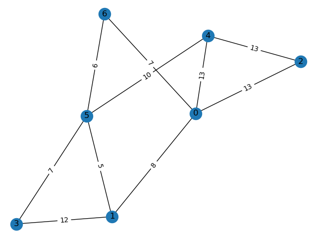

# Prim-s-algorithm-with-drawn-Graph
This project creates a random graph and applies Prim's algorithm on it.
The interesting part of the project was the drawing of the graph.
After you run the script you can see the graph and the tree obtained after the algorithm was applied.

## Graph picture:

## Tree picture:

